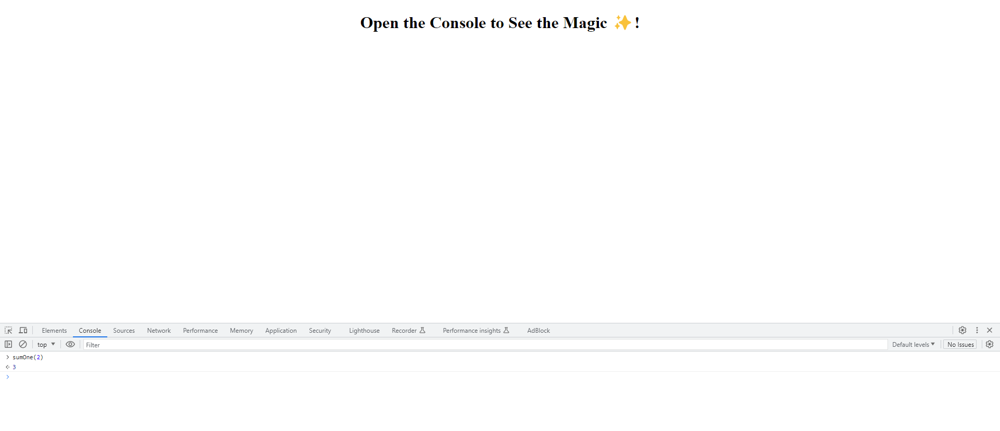

# Sum By One

## Description
```
    Write a function that takes in an integer and outputs the sum of all the numbers from 1 to that integer.

    Ex:
    Input: 2
    Output: 3 (because 1 + 2 = 3)

    Input: 4
    Output: 10  (because 1 + 2 + 3 + 4 = 10)

    Input: 10
    Output: 55
```
The challenge was to allow the user to input a integer of their choice and get an output of the integer being added by one. Through this challenge, I was able to better understand how functions works and using the for loop.

Website: 


## Table of Contents (Optional)

If your README is long, add a table of contents to make it easy for users to find what they need.

- [Installation](#installation)
- [Usage](#usage)
- [Credits](#credits)
- [License](#license)

## Installation

N/A

## Usage

When you enter the broswer, the user asked to open into their console which they can do by right-click and clicking on Inspect on the menu or using CTRL + SHIFT + I. Once in the Devtools, the user can input their own integar they wish to see the sum of. To do so, the user will need to type "sumOne(a)" where they replace "a" with their own integar and the log will output all the sum by one to that integer. 

    ```md
    
    ```

## Credits

N/A

## License

N/A

## Badges

N/A

## Features

N/A

## How to Contribute

N/A

## Tests

N/A
